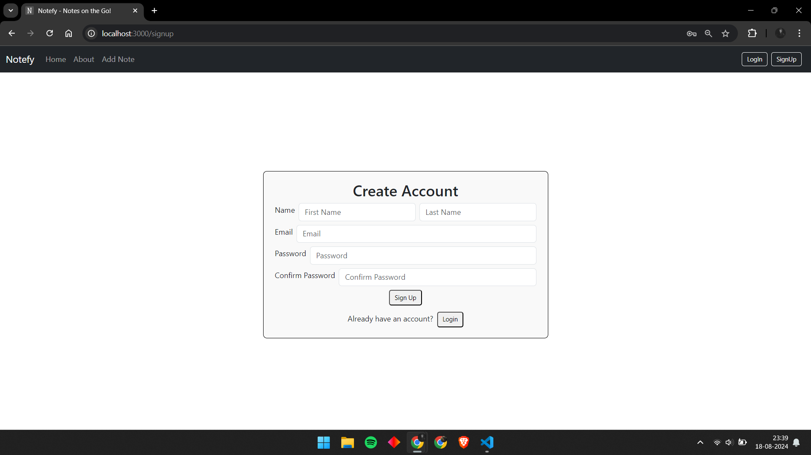
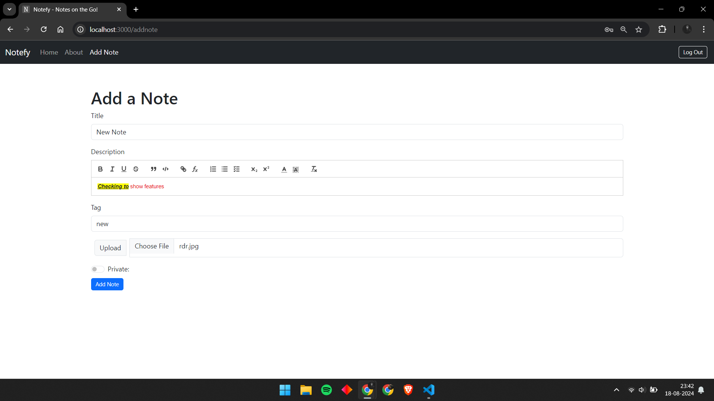
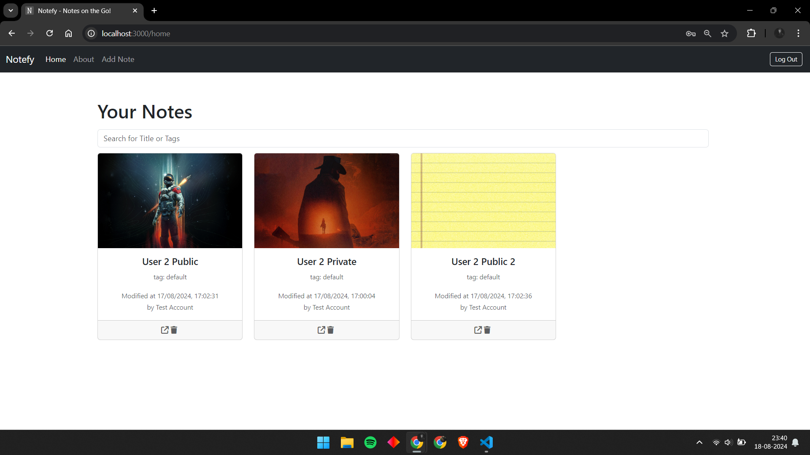
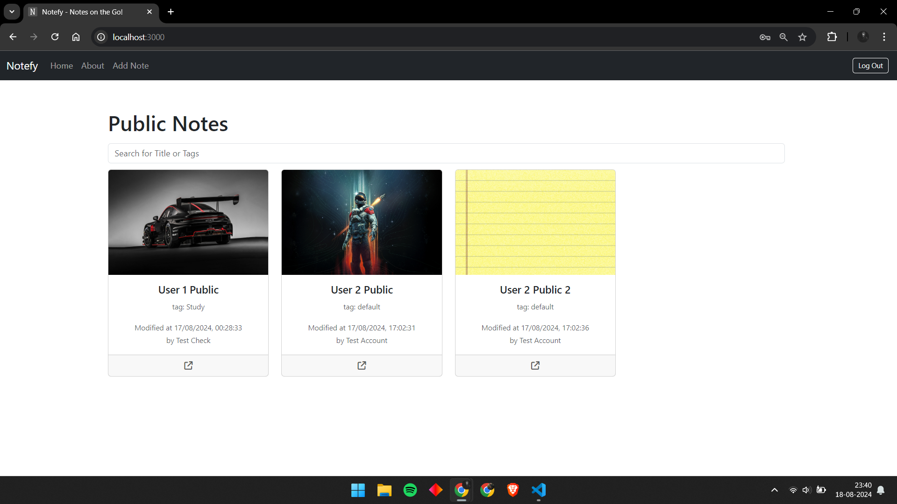
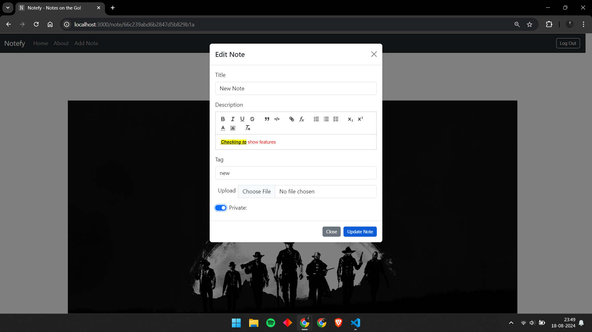
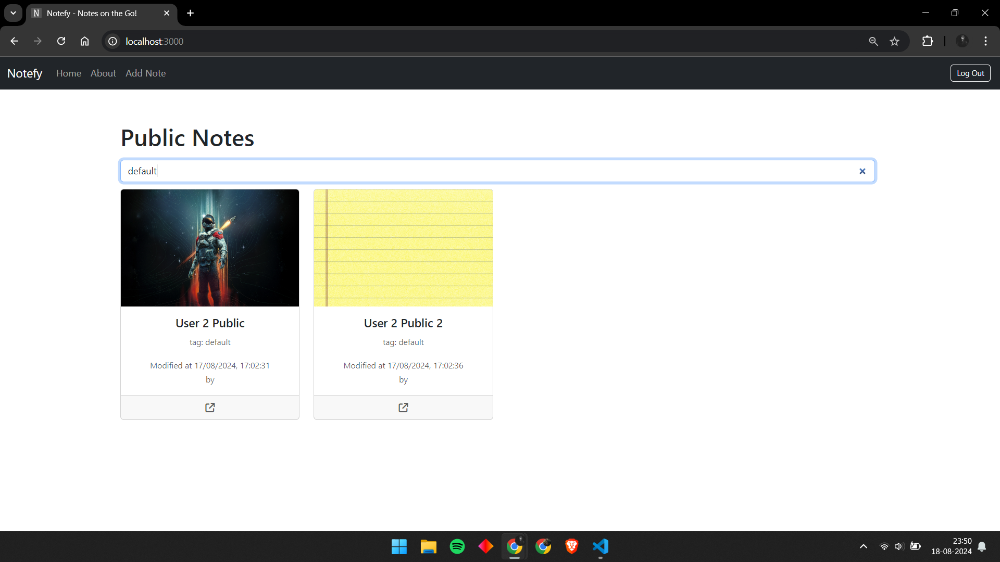

# Notefy: The Notes Application (MERN Stack)

Welcome to the Notefy, a web-based platform developed using the MERN stack (MongoDB, Express, React, Node.js). This application allows users to securely sign up, log in, and manage their personal notes. With the ability to add detailed notes, search for notes, and view public notes, this app offers both privacy and collaboration.

## Features

### 1. User Authentication (Sign Up & Login)
- Users can create an account via the **Sign Up** page.
- Existing users can securely log in via the **Login** page to access their notes.



### 2. Add Notes with Detailed Attributes
- Users can add notes with the following attributes:
  - **Title**: A concise title for the note.
  - **Description**: A detailed description of the note.
  - **Tags**: Tags for better categorization and searching.
  - **Picture**: Option to upload a picture associated with the note.
  - **Privacy Option**: Notes can be marked as private to be visible only to the creator.
  - **Rich Text Editor**: Users can format their notes with a built-in rich text editor.



### 3. Home Directory - Personal Notes
- Upon logging in, users are directed to their home directory where they can view all their personal notes.
- Private notes will only be displayed to their respective owners.



### 4. Public Notes Directory
- All public notes from all users are displayed in the public directory `/`.
- Public notes can be browsed without logging in.



### 5. Edit Notes
- Logged-in users can edit their notes using the rich text editor, allowing for seamless content updates.



### 6. Delete Notes
- Users can also delete their notes from both the home directory and public directory (if the note is public).


### 7. Search Functionality
- Users can search for notes on both the public and personal directories by:
  - **Title**
  - **Tags**



## Technologies Used
- **Frontend**: React.js
- **Backend**: Node.js with Express.js
- **Database**: MongoDB
- **Authentication**: JSON Web Token (JWT)
- **Security**: Used bcryptjs for encrpyting passwords.  
- **Rich Text Editing**: Integrated using a rich text editor

## Installation Instructions
1. Clone the repository.
2. Install dependencies for both the frontend and backend:
   ```bash
   cd frontend
   npm install
   cd ../backend
   npm install
3. Set up environment variables in a .env file (e.g., MongoDB connection string, JWT secret, etc.).
4. Start the servers:
   ```bash
   cd backend
   npm start
   cd ../frontend
   npm start
5. The application should be accessible at http://localhost:3000 for the frontend and http://localhost:5000 for the backend.

## Future Enhancements
   Note-sharing with specific users.

## License
   This project is open-source and available under the MIT License.
